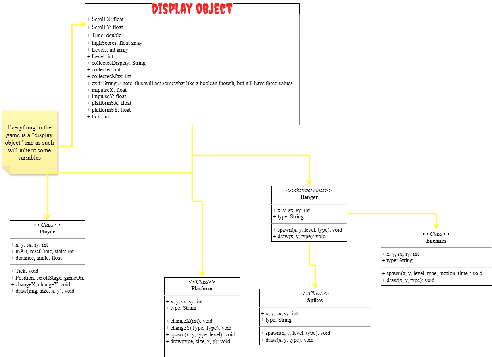

# Full Prototype:

### Period: $${\color{blue}3}$$

### Group members' names: $${\color{blue}Arko \space Chakrabartiroy}$$

#### Group Name (be creative and lean into it!): $${\color{blue}Platform \space Lords}$$

### Brief Project description (1 paragraph summary):

Scrolling platformer game, with multiple levels and various features, such as enemies and collectibles. The player can be controlled with arrow keys (and maybe WASD). Processing will be used for graphics, including the "world", player movement (including gravity), enemy movement, rendering of sprites, etc. Scoring (i will murder my shift keys after writing this) will be based on time (i.e. the less time you take to complete the level, the better). Later/more challenging levels will only be unlocked after the previous levels are completed (however, to ensure that total noobs are able to still play (and fail miserably at) multiple levels, the first three levels will be unlocked at the beginning).

---

## Expanded Description:

### Critical features (Minimum Viable Product) - What you want to have after 1.5 weeks.

1. A working player sprite that can move around (controls would be arrow keys and maybe WASD) and jump (with gravity mechanics implemented) with up/W/space key
2. Platform sprites that function as "ground" and stuff that player can jump on and move on
3. Collectibles (e.g. coins) spawning in different (possibly randomized) places
4. Enemies (e.g. spikes, lava) spawning in different places; if player touches these, player dies and respawns at beginning(?) of level
5. Gravity (mentioned in #1 but this deserves a bullet of its own here because of its importance in any platformer)--player jumping, falling, etc
6. Either set levels (static or scrolling) or infinite scrolling

---

### Nice to have features - What you would want to have by the end

1. Wall jumping
2. **Different types of platforms that have different functions (examples of this below):**
3. Floating platforms
4. Moving platforms (i.e. sliders)
5. Teleporters
6. Trampolines
7. Ground holes/caves (think beginning of gen. red lvl 3)
8. Clouds (functioning as temporary platforms that disappear shortly after you jump on them)
9. **Different types of enemies/danger that do different things (examples of this below):**
10. Lava
11. Spikes
12. Moving spikes
13. Moving spears/arrows
14. "Big Green" (think beginning of gen. red lvl 1)
15. Rotating maces
16. "Spikie"s (see gen. red sprites), these are rotating I believe
17. "Blade"s (see gen. red sprites), not a great name but these things are circular rotating with spikes around circumference

---

# Technical Details:

A description of your technical design. This should include: 
   
How you will be using the topics covered in class in the project.

*There will be a class that will contain variables shared by everything in the game (i.e. every single class will extend this class, similar how to every class in Java is a subclass of Object). There will be a player class, a platforms class, a danger class, and an enemies class (more classes may be added later on).*   

**Topics covered in class that will be used in the project:**  
- Basic (i.e. primitive, and String) types (the usage of these are fairly obvious)
- Expressions (e.g. math): this will be used to set and change player x and y positions, and scroll x/y positions, among MANY other things
- Arrays (including ArrayList, LinkedList, etc.): these will be used to store values such as player coordinates (x, y), high scores for different levels, spawn points for platforms/enemies by level, etc.
- Classes: different types of objects are represented by classes
- Loops: game loops will be used to control and update positions and other variables during gameplay
- Conditionals (e.g. if, else statements): used to check collisions (e.g. if (player touching enemy) {player dies}, etc) and a lot of other things
- Exceptions (try/catch, throw, throws, etc): will be used in earlier stages of game development as a tool to debug processes
- Recursion: possibly used in gravity/ground-touching scripts
- Processing: all the graphics will be here, so processing plays a huge role in this project overall
- Time/space complexity: will be used to make methods as efficient as possible

     
# Project Design

UML Diagrams and descriptions of key algorithms, classes, and how things fit together.

    
# Intended pacing:

How you are breaking down the project and who is responsible for which parts.
- I'm working solo, so I'm responsible for all parts

A timeline with expected completion dates of parts of the project.

- Player, Platforms constructor and draw functions - 05/28
- Player movement and gravity - 05/29
- Platform generation - 05/30
- Scrolling mechanics - 05/31
- First level (only player and platforms so far) - 06/01
- Danger constructor, draw functions - 06/03
- Danger generation, player death - 06/04
- Collectibles constructor, draw, generation - 06/05
- Exit (i.e. portals once level won) - 06/06
- Background - 06/06
- Enemies constructor, draw functions, generation - 06/08
- Additional levels and final touches - 06/10
